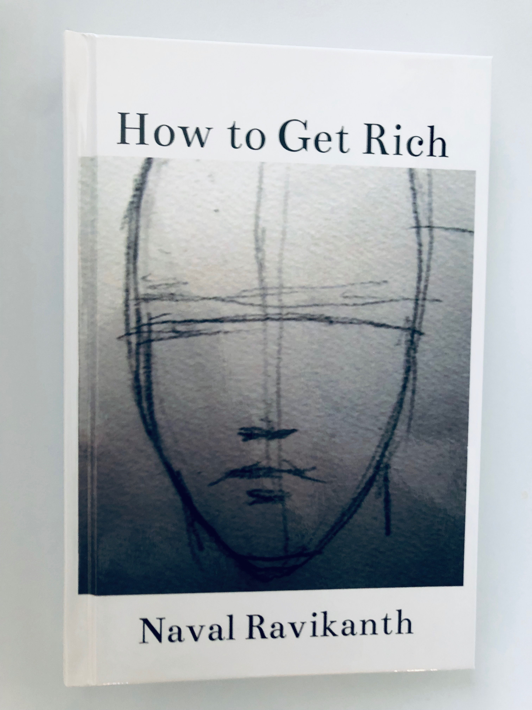
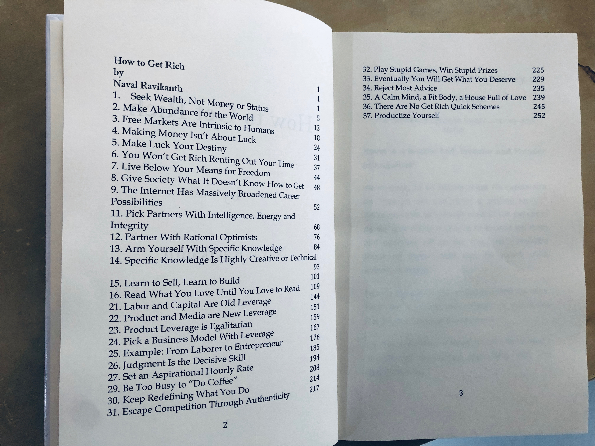

# how to get rich - Naval Ravikanth

The source of this is [https://nav.al/how-to-get-rich](https://nav.al/how-to-get-rich). 

## book
Used the originial content into a printing a physical book with [bookbaby](https://www.bookbaby.com/)

### Why print into a book? 
As much as I love technology, I love to read physical books because it makes me disconnect from the noise and focus on my thoughts.

The `table of contents` helps me navigate to specific sections.

### Why not spiral bound?
Yes, spiral bounding would have worked out cheaper. But it doesn't give me the real book feel. I like to take this along to a coffee shop and keep it in my bookshelf and spiral bound does not feel like a real book.

### How did you do it?

1. Download the content into  [https://nav.al/how-to-get-rich](https://nav.al/how-to-get-rich) a doc.
2. Use https://fiverr.com to format the doc into a  `US Trade` format
3. For the book cover used [naval](https://twitter.com/naval) twitter picture. It had to be formatted into book cover design. I used fiverr for this also.
4. Uploaded the content to bookbaby and had them print me a copy

### How much does it cost?
It would cost `$38`, including shipping. 

### Where can I get the formatted cover and content?
1. [cover.jpg](./cover.jpg)
2. [howtogetrich.pdf](./howtogetrich.pdf)

